# Rapport TP1 : Reconnaissance de formes simples
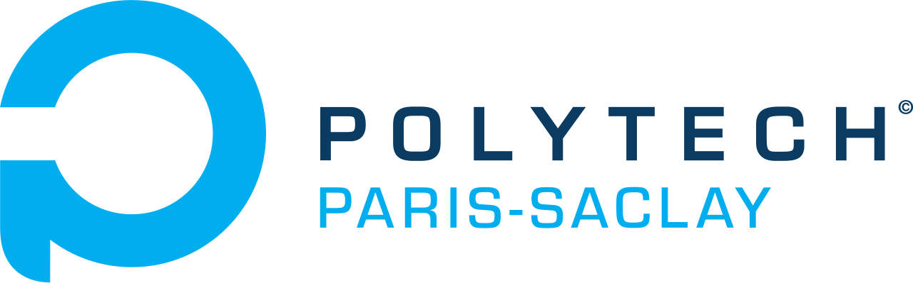
**Date :** 12 Février 2026  
**Anas DAGGAG - Jeremy DOUBLET - APP5 EIE**

---

## Objectif

Implémenter 3 méthodes de reconnaissance automatique de formes géométriques (cercle, triangle, octogone, carré, rectangle) basées sur différents descripteurs.

**Données :**
- 5 images de référence (00-04) : une par catégorie
- 22 images test (05-26) à classifier
- Classes : 0=cercle, 1=triangle, 2=octogone, 3=carré, 4=rectangle

---

## Exo 1.1 : compacité

### **Function myShapeCompute (dans shape.py)**
**Elle prend en entrée la forme à reconnaître et calcule plusieurs paramètres. Ajouter les différents paramètres suivants :**

**- aire : compter le nombre de pixels de l'objet**

L'aire est obtenue dans `stats[4]`.

**- périmètre : longueur du contour**
  - **compléter myFreemanCode pour déduire le code de Freeman de la forme à partir de la chaîne du contour obtenue par cv2.findContours**
  - **compléter myPerimeter pour en déduire le périmètre**

Le code de Freeman encode les 8 directions possibles entre points consécutifs du contour. Pour chaque point, on calcule le vecteur `d=[dx,dy]` vers le point suivant, puis on normalise à -1, 0, ou 1, et on utilise la matrice Freeman pour obtenir la direction (0 à 7).

Le périmètre se calcule ensuite en sommant les distances : 1 pour les directions horizontales/verticales (paires : 0,2,4,6), et √2 pour les diagonales (impaires : 1,3,5,7).

**- en déduire la compacité et vérifier qu'elle est maximale pour les ronds**

La compacité est calculée par : 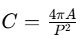 où A=aire, P=périmètre.

Elle est proche de 1 pour un cercle (forme la plus compacte) et diminue pour les formes allongées.

---

### **Function myCompacityAnalysis(param_test, param_ex)**
**Compléter la fonction pour qu'elle :**
- **compare la compacité de chaque forme (param_test) avec celles des exemples (param_ex)**
- **renvoie la catégorie pour chaque forme (0 :cercle, 1 : triangle, 2 : octogone, 3 : carré, 4 : rectangle)**
- **Commenter les résultats obtenus.**

### Résultats

```
prediction   :    [2 0 2 4 1 1 3 1 0 3 3 3 3 1 4 1 1 1 2 3 0 0]
ground truth :    [2 2 2 4 4 4 4 4 0 3 3 3 3 1 1 1 1 1 2 5 0 0]
compacite    :    [0.94, 0.92, 0.94, 0.57, 0.53, 0.29, 0.74, 0.51, 0.91, 0.69, 0.69, 0.69, 0.8, 0.54, 0.57, 0.53, 0.53, 0.54, 0.95, 0.82, 0.91, 0.9]
Accuracy : 68.2%
```

Rappel :
```
CERCLE=0
TRIANGLE=1
OCTOGONE=2
CARRE=3
RECTANGLE =4
AUTRE=5
```

Valeurs de compacité observées :
- Cercles/Octogones : 0.90-0.95 → confusion fréquente
- Carrés : ~0.70-0.80
- Rectangles : ~0.50-0.70  
- Triangles : ~0.50-0.55

**-** Les octogones ressemblent trop aux cercles. Difficile de distinguer carrés des rectangles.

---

## Exo 1.2 : moments de Hu

### **Calcul des moments de Hu**
**Dans la fonction myShapeCompute (dans shape.py), rajouter le calcul des moments de Hu (en utilisant les fonctions d'opencv)**

Les moments de Hu ont été ajoutés à la fonction `myShapeCompute`. On utilise d'abord `cv2.moments()` pour obtenir les moments géométriques (invariants à la translation), puis `cv2.HuMoments()` pour calculer les 7 moments de Hu qui sont invariants à la translation, rotation et échelle.

### **Function myHuMomentsAnalysis(param_test, param_ex)**
**Compléter la fonction pour qu'elle :**
- **compare les 7 moments de Hu d'une forme (param_test) avec ceux des formes exemples (param_ex)**
- **renvoie la catégorie de la forme**
- **Commenter les résultats obtenus.**

### Résultats

```
prediction   : [2 3 2 4 4 4 1 4 0 3 3 3 3 4 1 1 1 1 2 2 0 0]
ground truth : [2 2 2 4 4 4 4 4 0 3 3 3 3 1 1 1 1 1 2 5 0 0]
Accuracy : 81.8%
```

**-** Meilleure performance. Les moments de Hu capturent bien la géométrie des formes et sont robustes aux rotations. Par contre, on a besoin d'images de référence et certaines confusions persistent (octogone prédit comme carré, triangle prédit comme rectangle).

---

## Exo 1.3 : signature

### **Function mySignature**
**Compléter la fonction pour qu'elle renvoie la signature de l'objet**

### **Function mySignatureAnalysis(param_test)**
**- Mettre à jour la fonction pour qu'elle analyse la signature et en déduise la classe de chaque forme**
**- Commenter les résultats**

- Cercle : variabilité très faible (signature quasi-constante)
- Triangle : 3 maxima (3 sommets)
- Carré/Rectangle : 4 maxima (4 coins)
- Octogone : 7-9 maxima (8 côtés)

### Exemples de signatures

**Cercle :** Signature constante, pas de variation

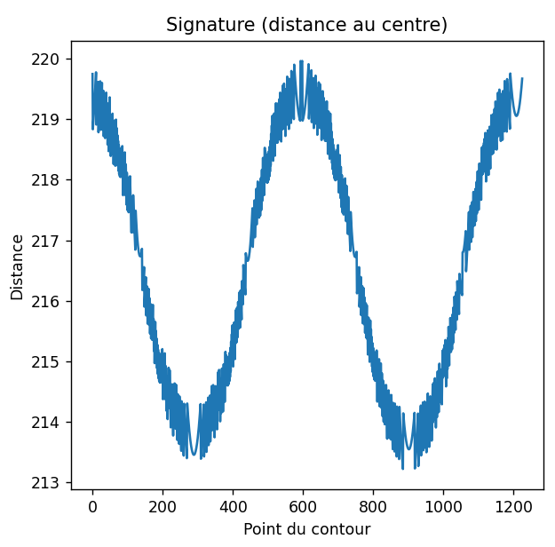

**Triangle :** 3 maxima nets correspondant aux 3 sommets

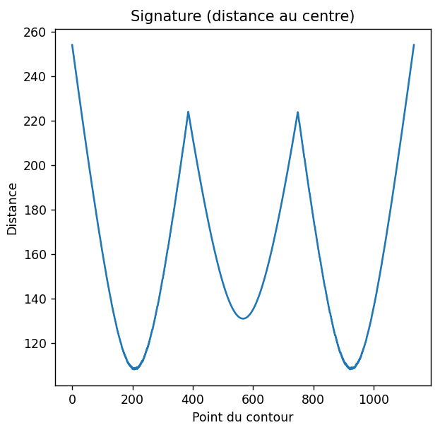

**Carré :** 4 maxima d'amplitudes égales (géométrie régulière)

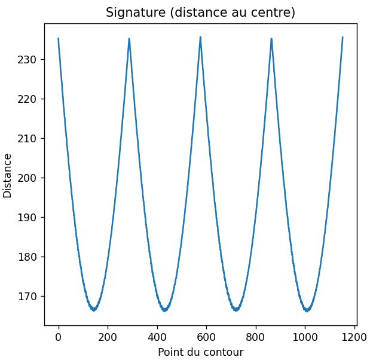

**Rectangle :** 4 maxima avec 2 amplitudes moins grandes 

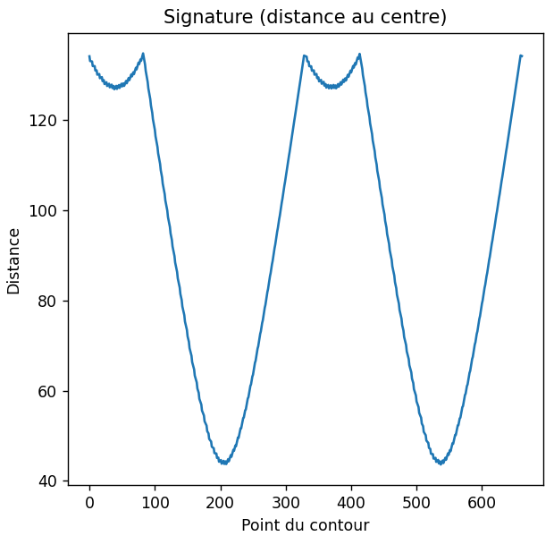

**Hexagone :** 6 maxima régulièrement espacés

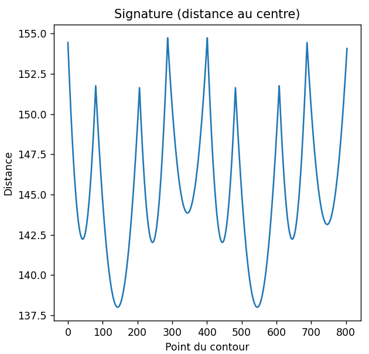

### Gestion des cas problématiques

**Problème 1 : Différenciation carré/rectangle**

Les deux formes ont 4 maxima. On les différencie en analysant le **rapport entre maxima** :

- **Carré :** Les 4 distances maximales sont identiques (4 coins équidistants du centre)
  - 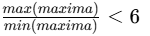

- **Rectangle :** 2 distances différentes car les coins des côtés longs sont plus éloignés du centre que ceux des côtés courts
  - 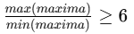

Cette approche fonctionne bien car l'allongement du rectangle crée une différence significative entre les amplitudes des maxima.

**Problème 2 : Détection du cercle**

À cause de la pixelisation, un cercle peut présenter de nombreux petits maxima parasites. Le simple comptage ne suffit pas. On utilise donc l'**écart-type relatif** de la signature :

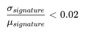

Pour un cercle, même pixellisé, la distance au centre varie très peu (signature quasi-constante). Ce critère permet de distinguer un cercle d'un octogone qui a aussi une signature relativement régulière mais avec 8 variations nettes.


### Résultats

```
prediction   : [2 2 2 4 4 4 4 4 0 3 3 3 3 1 1 1 1 1 2 5 0 0]
ground truth : [2 2 2 4 4 4 4 4 0 3 3 3 3 1 1 1 1 1 2 5 0 0]
Accuracy : 100%
```

**-** Performance parfaite. Le comptage des maxima permet d'identifier précisément le nombre de sommets. Le filtrage gaussien avec 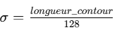 élimine bien le bruit de pixellisation. Avantage majeur : pas besoin d'images de référence.

---

## Synthèse

| Méthode | Accuracy | Avantages | Inconvénients |
|---------|----------|-----------|---------------|
| **Compacité** | **68%** | Simple et rapide<br>Calcul peu coûteux<br>Bon pour formes régulières | Besoin d'images de référence<br>Confusion cercle/octogone<br>Confusion carré/rectangle |
| **Moments de Hu** | **82%** | Robustes aux rotations et changements d'échelle<br>Meilleure performance que la compacité<br>Capture bien la géométrie des formes | Besoin d'images de référence<br>Calcul plus complexe<br>Confusions persistent sur certaines formes |
| **Signature** | **100 %** | Pas besoin d'images de référence<br>Intuitive géométriquement<br>Identification directe du nombre de sommets<br>Performance parfaite sur ce dataset | Sensible au choix du filtrage<br>Nécessite un bon prétraitement<br>Paramètre σ à ajuster selon la taille du contour |

---

## Conclusion

- Les descripteurs simples (compacité) sont souvent plus efficaces que les descripteurs complexes (moments de Hu) pour des formes géométriques basiques
- L'analyse de signature est puissante mais nécessite un bon prétraitement (filtrage)
- Aucune méthode seule n'atteint une performance parfaite


# Rapport TP1 partie 2 : Reconnaissance de panneaux 

- La deuxième partie consiste à reconnaitre les formes d'un dataset d'images 


La première partie à été de comprendre comment le code de binarisation des panneaux fonctionne puis d'appliquer la méthode de reconnaissance de formes à la binarisation de l'image. 

La problèmatique rencontré est la mauvaise binarisation de l'image, des artéfacts qui ne font pas partie du panneau s'affiche et la fonction de reconnaissance de forme esssaie d'associer une image au différentes artéfacts générer


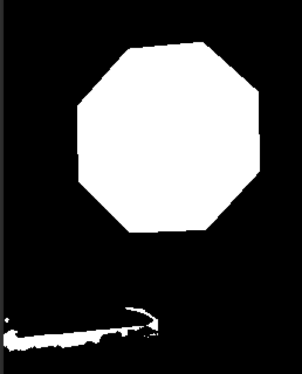
 
Exemple sur cette image en dessous de l'exagone, la fonction signature analyse un octogone et 2 triangles
cercles :  0 triangles:  2 octo:  1

Pour améliorer le traitement il faudrait améliorer d'abord le traitement de la binairisation pour pouvoir faire un traitement plus facile avec la signature